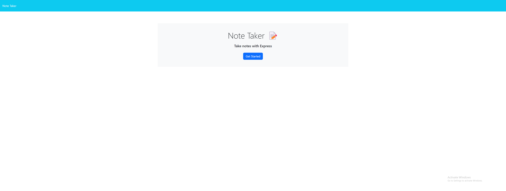
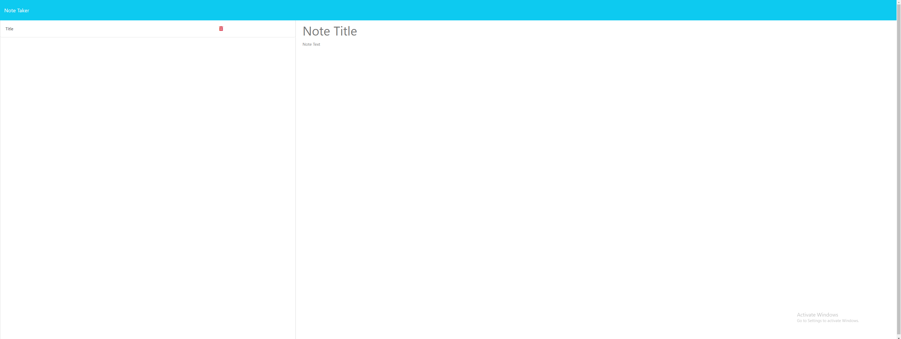

# Note-Taker

## Description

This project is a simple and efficient note-taking application. 

- The motivation for this project was to create a tool that can help users keep track of a lot of information and provide quick access to their notes.
- This project was built to help users who have a need to keep track of a lot of information. It's easy to forget or be overwhelmed by the sheer amount of tasks and other information we need to remember on a daily basis. This note-taking application allows users to have a constant, organized, and accessible place to store all this information.
- This application solves the problem of managing and organizing notes. Users can easily create, view, and delete notes, which makes managing a large amount of information easier.
- While building this project, I learned more about backend development using Node.js and Express.js. I also learned about the importance of structuring a project well and making the application's routes efficient and clean.

## Usage

To use this application, navigate to the homepage and click on the "Get Started" button. This will take you to the notes page where you can view, create, and delete notes.

